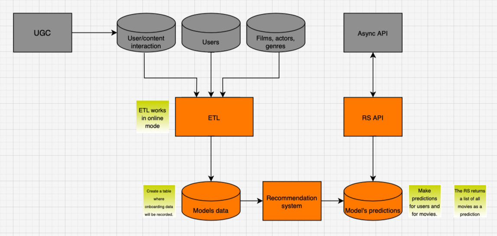

# Silver Stream streaming platform

### Service architecture



### dev version launch
```
make build-n-run
```

### ASYNC API - client's API, for front
```
http://0.0.0.0:8000/api/openapi
```

### RS API - Recommendation system API
```
http://0.0.0.0:8888/api/openapi
```

### RS - Inner API of recommendation system
```
http://0.0.0.0:8080/rs/docs
```